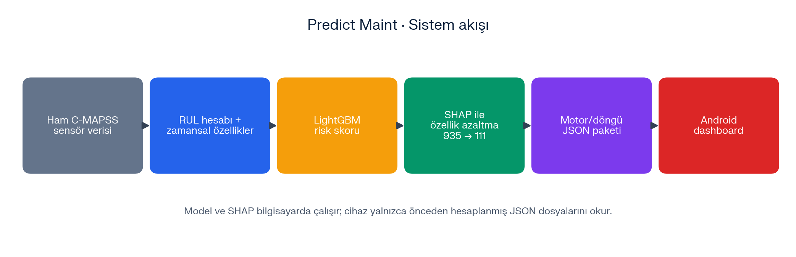
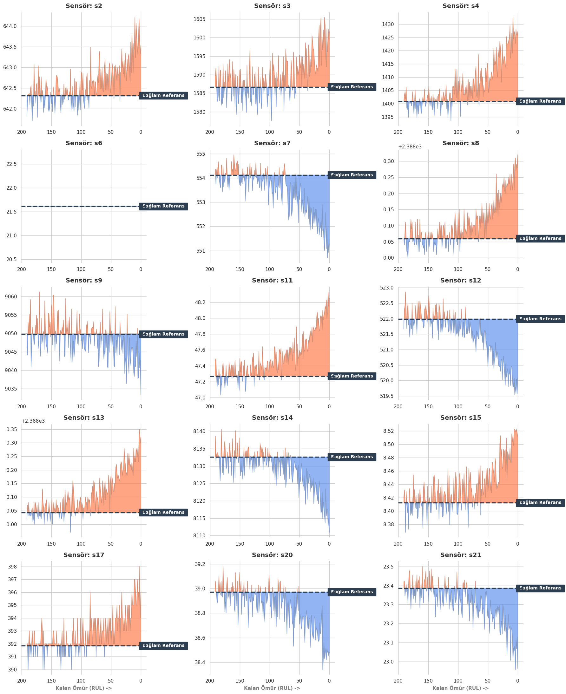
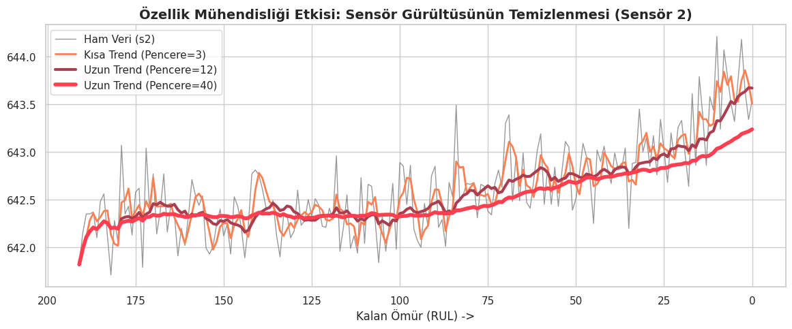
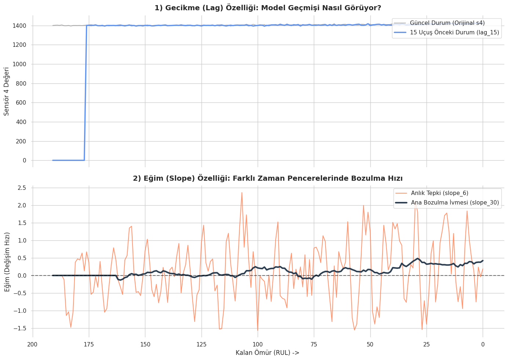
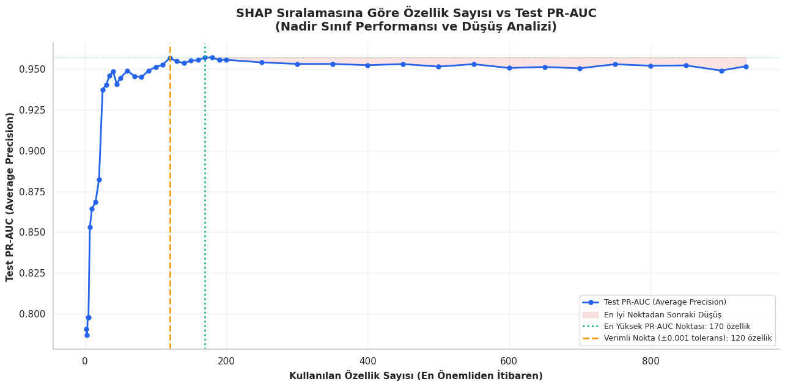
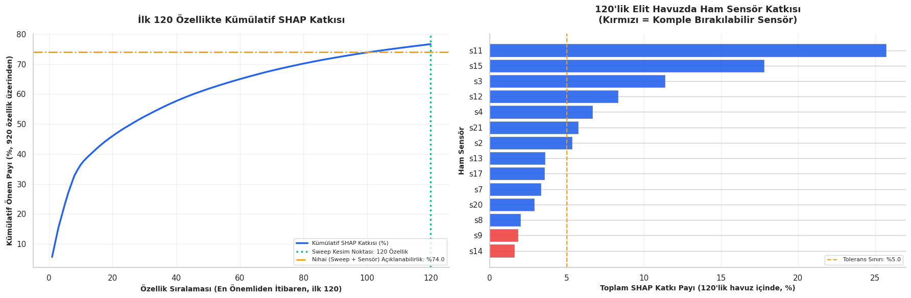
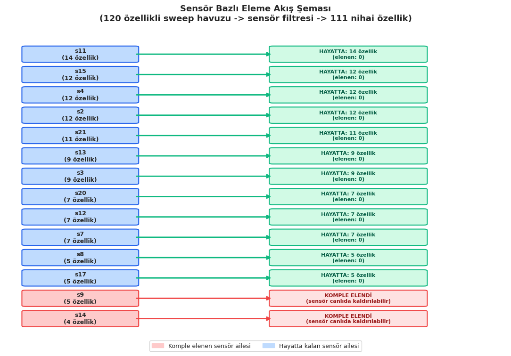
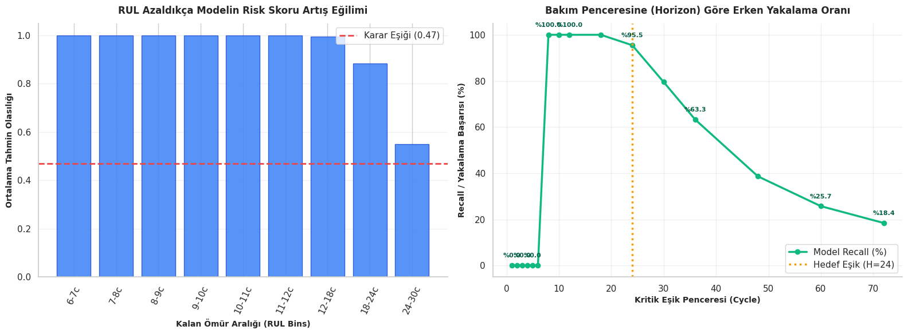
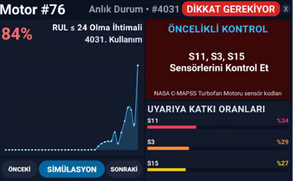

# Predict Maint

**Explainable early-failure risk prediction for turbofan engines, with a QR-driven Android dashboard.**

Predict Maint is a predictive maintenance prototype built on the NASA C-MAPSS (FD001) turbofan engine dataset. From an engine's sensor history it estimates a **risk score**, explains which sensors drove the warning (SHAP), and presents the result in an Android app opened by scanning a QR code. The app targets the Cyclops device.

> **Scope:** the data is a NASA **simulation**, not real fleet data. This project demonstrates the modeling approach and a mobile decision-support display. It is a prototype and does not replace a real maintenance decision.



*Note: figure labels inside the images are in Turkish; the surrounding text explains each one.*

---

## Contents

1. [Why a risk score?](#why-a-risk-score)
2. [Dataset](#dataset)
3. [Method](#method)
4. [Results](#results)
5. [Thresholds explained](#thresholds-explained)
6. [System architecture](#system-architecture)
7. [Android app](#android-app)
8. [Repository layout](#repository-layout)
9. [Getting started](#getting-started)
10. [Limitations and next steps](#limitations-and-next-steps)
11. [Data source](#data-source)

---

## Why a risk score?

A technician in the field cannot know in advance exactly how many cycles an engine has left. Showing a precise remaining-life number would present information that is not actually available.

Instead, the model estimates the **probability that an engine has entered the critical zone** (`RUL <= HORIZON_CYCLES`), where RUL is the *remaining useful life* in flight cycles. The output is a risk percentage and an alarm flag, plus the sensors that contributed most to the warning, so the technician knows where to look first.

<!-- TODO: state the final HORIZON_CYCLES value here once the notebook has been re-run and its outputs are consistent with the code. -->

## Dataset

**NASA C-MAPSS**, subset **FD001**. The engines are simulated, so the results are indicative, not proof of field performance.

| Item | Value |
|:---|:---|
| Engines (train / test) | 100 / 100 |
| Rows (train / test) | 20,631 / 13,096 |
| Columns | `unit`, `cycle`, 3 operating settings, 21 sensors |
| Constant columns removed | 7 (`set3`, `s1`, `s5`, `s10`, `s16`, `s18`, `s19`), 26 → 19 columns |

- **Train engines run until failure.** RUL is the engine's last cycle minus the current cycle.
- **Test engines are truncated before failure**, as they would be in practice. Their true RUL comes from the reference file `RUL_FD001.txt`: last observed cycle + reference RUL − current cycle.

The plot below compares each sensor of one engine against its own *healthy reference* (the mean of its first 20 cycles). Some sensors drift clearly as the engine approaches failure; others barely move.



## Method

```text
Raw data
  → clean constant columns, compute RUL
  → time-series features (rolling mean/std, lag, slope)   → 935 features
  → MinMax scaling (fit on training data only)
  → risk label: RUL <= HORIZON_CYCLES
  → LightGBM classifier (class weighting + early stopping)
  → SHAP ranking + feature-count sweep + sensor elimination → 111 features
  → retrain, choose alarm threshold by F1
  → export per-engine, per-cycle JSON for the Android app
```

### Time-series features

A single sensor reading is noisy. For each sensor the notebook derives rolling means and standard deviations over several windows, lagged values, and slopes, which describe how the sensor has been *moving*.





### Feature reduction

Many derived features carry overlapping information. Features were ranked by SHAP importance (averaged over several random samples for stability), and models were retrained with the top *N* features to see how performance changes.

| Stage | Features |
|:---|---:|
| All derived features | 935 |
| After feature-count sweep | 120 |
| After sensor-level elimination (`s14`, `s9`) | **111** |

The best PR-AUC in the sweep was 0.9572 with 170 features. With 120 features it was 0.9568, within a 0.001 tolerance, so the smaller set was used.



Within the 120-feature pool, sensors were ranked by their combined SHAP share. Sensors `s14` and `s9` together contribute about 3.5% of the pool, below the 5% tolerance, so they were removed entirely. The 120 features cover about 76.7% of the total SHAP importance across all 935 features.





## Results

Final model: LightGBM on **111 features**.

| Metric | Value |
|:---|---:|
| Test ROC-AUC | 0.9975 |
| Test PR-AUC (average precision) | 0.9222 |
| Precision at the chosen threshold | 0.828 |
| Recall at the chosen threshold | 0.795 |
| ROC-AUC change vs. the 935-feature model | −0.0009 |

Reducing the input from 935 to 111 features changed ROC-AUC by less than 0.001 in this experiment.

Because the risky class is rare in the test set, PR-AUC and recall are reported alongside ROC-AUC. Detection is strongest for engines very close to failure and weaker near the edge of the risk window.



## Thresholds explained

Three different numbers play three different roles. They are easy to confuse.

| Value | Role | Meaning |
|:---|:---|:---|
| `HORIZON_CYCLES` | Risk label | `RUL <= HORIZON_CYCLES` marks a row as *risky* in training and evaluation. |
| 5% | Sensor elimination | Maximum combined SHAP share of the sensors removed from the 120-feature pool. It is **not** a guarantee of at most 5% performance loss. |
| 0.4696 | Alarm threshold | The probability that maximizes F1 for the final model. `proba >= 0.4696` → `alarm = true`. |

Raising the alarm threshold reduces false alarms but misses more genuine warnings; lowering it does the opposite. In a real deployment it should be tuned to the cost of each kind of error.

## System architecture

The model and SHAP are **not run on the device**. Predictions and explanations are computed in advance on a PC and exported as lightweight JSON. The Android app only reads and displays them.

```text
PC / Kaggle notebook                       Android app
────────────────────                       ───────────
features → LightGBM → SHAP  ──► JSON ──►  QR scan → snapshot / simulation view
                            (per engine)
```

Each engine has a `motor_<id>.json` file with, for every cycle: the risk probability, the alarm flag, and the top contributing features (SHAP). `metadata.json` holds the engine list and the threshold.

**In the field** the chain would be the same: sensor data → feature computation → model → threshold → explanation → display. In this prototype the middle steps are precomputed, so the app is a **display and simulation prototype, not a live sensor integration**.

## Android app

- **Language / SDK:** Kotlin, `minSdk 24`, landscape orientation
- **QR scanning:** ZXing (`zxing-android-embedded`)
- **Charts:** MPAndroidChart
- **Data:** JSON files bundled in `app/src/main/assets/mobile_export/`
- **Demo engines:** 34, 35, 56, 66, 76

### How it works

1. **Scan a QR code.** The engine number in the code selects the engine; invalid codes show an error.
2. **Snapshot view.** The app opens at the engine's first alarm: risk percentage, usage counter, and a risk chart.
3. **Simulation.** The engine's record plays step by step (0.5 s per step), updating the risk, the priority sensors, and the contribution bars.

The screen shows a **risk percentage and usage counter, never the remaining life**, and lists the sensors to check first, together with each sensor's relative share of the warning.

| QR scan screen | Dashboard |
|:---:|:---:|
|  |  |

<!-- TODO: describe the USB camera activity (UsbCameraActivity) here if it is a supported feature. -->

## Repository layout

| Path | Contents |
|:---|:---|
| `app/` | Android application (Kotlin) |
| `app/src/main/assets/mobile_export/` | Per-engine JSON and `metadata.json` |
| `notebook/` | Data analysis, model training, and JSON export (Jupyter) |
| `notebook/images/` | Figures used in this README |

## Getting started

### Android app

1. Open the project in **Android Studio** and wait for the Gradle sync.
2. Run it on a device or emulator (camera permission is required for QR scanning).
3. Generate QR codes whose content is an engine number (34, 35, 56, 66, or 76) and scan one.

### Notebook

The notebook was run on Kaggle. The code reads the data from `/kaggle/input/datasets/behrad3d/nasa-cmaps/CMaps/`, and the raw data is not included in this repository. To run it elsewhere, download the C-MAPSS files and adjust `data_dir`. The last cells regenerate the JSON files used by the app.

Main libraries: pandas, NumPy, scikit-learn, LightGBM, SHAP, matplotlib, seaborn.

## Limitations and next steps

**Limitations**

- The data is simulated and has not been validated on real engines.
- The number of features and the alarm threshold were chosen by looking at the test data, so the reported metrics are **not** an independent final evaluation.
- The early-stopping validation split is row-based; rows from the same engine can fall on both sides.
- The app is a display/simulation prototype and does not process live sensor data.

**Next steps**

- Select features and thresholds on an **engine-level validation split**, keeping the test engines for the final evaluation only.
- Tune the alarm threshold to the cost of false alarms versus missed warnings.
- Evaluate on FD002–FD004 and on real operational data.

## Data source

**NASA C-MAPSS** (Commercial Modular Aero-Propulsion System Simulation), subset **FD001**. The data is synthetic (simulated), not real fleet data.

- **Original source:** NASA Prognostics Center of Excellence, [Prognostics Data Repository](https://www.nasa.gov/intelligent-systems-division/discovery-and-systems-health/pcoe/pcoe-data-set-repository/) (*Turbofan Engine Degradation Simulation Data Set*).
- **Copy used in this project:** [NASA C-MAPSS on Kaggle](https://www.kaggle.com/datasets/behrad3d/nasa-cmaps). The raw data is not included in this repository.

**Citation**

> A. Saxena and K. Goebel (2008). "Turbofan Engine Degradation Simulation Data Set", NASA Prognostics Data Repository, NASA Ames Research Center, Moffett Field, CA.

**Method reference**

> A. Saxena, K. Goebel, D. Simon and N. Eklund (2008). "Damage Propagation Modeling for Aircraft Engine Run-to-Failure Simulation", *2008 International Conference on Prognostics and Health Management (PHM08)*, Denver, CO. DOI: [10.1109/PHM.2008.4711414](https://doi.org/10.1109/PHM.2008.4711414)
